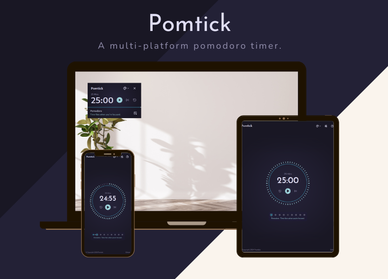

# Pomtick Pomodoro Timer

[](https://pomtick.pages.dev)


<div align="center">

  
  
  

  [Pomtick](https://pomtick.pages.dev) is a simple classy productivity timer with cross platform support 🎉
  


</div>

## ❔ What is Pomodoro?

The [Pomodoro Technique](https://en.wikipedia.org/wiki/Pomodoro_Technique) is a popular time-management method invented by Italian Francesco Cirillo. This strategy is beneficial if you become distracted while working on a project or want to determine how long a task will take. It's intended to help you focus on tasks and minimize procrastination by dividing work into focused intervals broken by brief pauses. It's perfect for a variety of tasks, including writing, coding, designing, and studying.

- **Work Intervals (Pomodoros)**: You set aside a certain amount of time to focus on a particular activity with few distractions.
- **Short Breaks**: Following each pomodoro, you take a little break to replenish your mind and body. This allows you to stay focused and avoid burnout during lengthy work sessions.

### Benefits of this Technique
- **Improved Focus**: By working in small bursts, you teach your brain to concentrate for long periods.
- **Reduced Procrastination**: Knowing you only have 25 minutes to focus makes it simpler to begin chores that would otherwise appear difficult.
- **Increased Motivation**: Doing pomodoros provides you a sense of success and keeps you going throughout the day.
- **Improved Time Management**: The Pomodoro Technique allows you to arrange your daily and avoid being overwhelmed by enormous activities.

### Traditional Timings:
- **Pomodoro**: 25 minutes
- **Short Break**: 5 minutes
- **Long Break (after 4 pomodoros)**: 15-30 minutes


## ✨ Features

- **Appealing minimal UI**
- **Themeable**: Multiple color theme choices, with dark mode
- **Customizable**: Adjust pomodoro/break duration and count 
- **Intuitive interface**
- **Auto-start pomodoro**
- **Visualization and progress indicators**
- **Compact Mode**
- **Always on top**: You don't have to peek frequently to check the timer progress


## 📃 Future Features 

- **Statistics tracking** 
- **Task listing & tracking**


## 🛠️ Run Locally

Clone the project

```bash
  git clone https://github.com/shinjith-dev/pomtick.git pomtick
```

Go to the project directory

```bash
  cd pomtick
```

Install dependencies

```bash
  pnpm install
```

Start the server

```bash
  pnpm run dev
```

## 🎨 Color Palette

This lovely, classy color palette was totally copied from [Rose Pine](https://rosepinetheme.com) [[Github](https://github.com/rose-pine)] , with heartfelt gratitude!


## 🤝 Contributing

Contributions are always welcome!

See [CONTRIBUTING.md](https://github.com/shinjith-dev/pomtick-web/blob/main/.github/CONTRIBUTING.md) for ways to get started.


## License

This project is licensed under [MIT](https://choosealicense.com/licenses/mit/)

